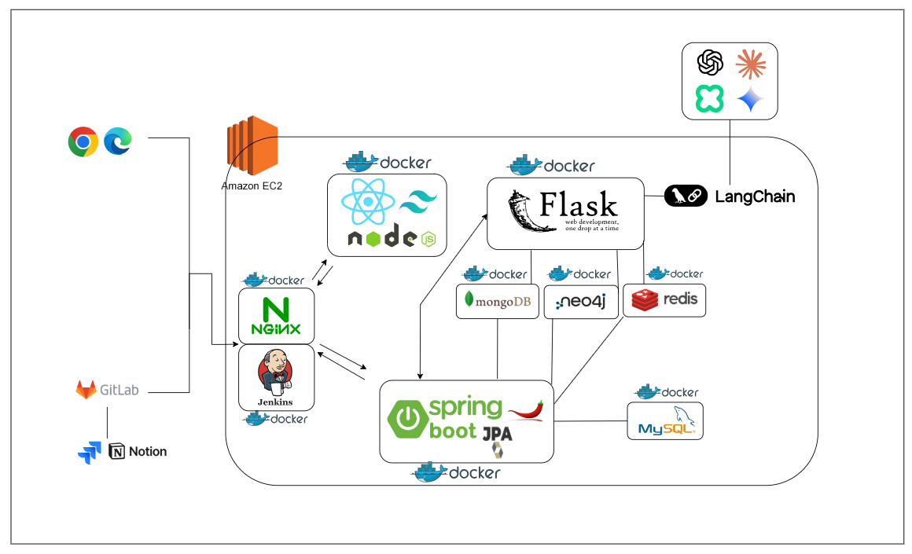
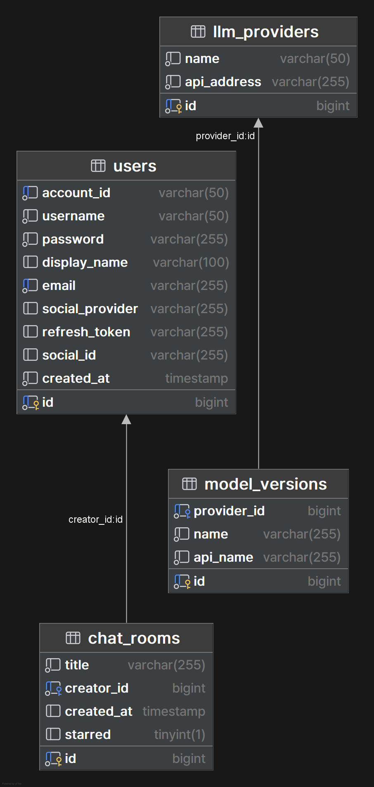
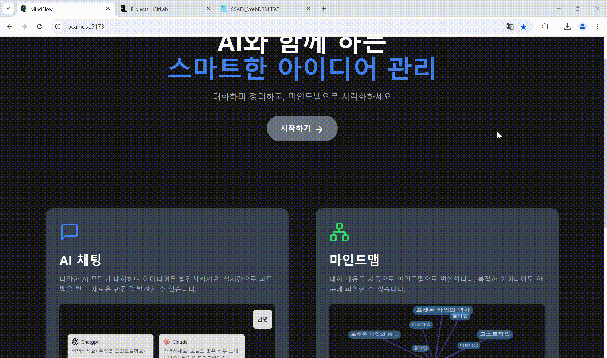
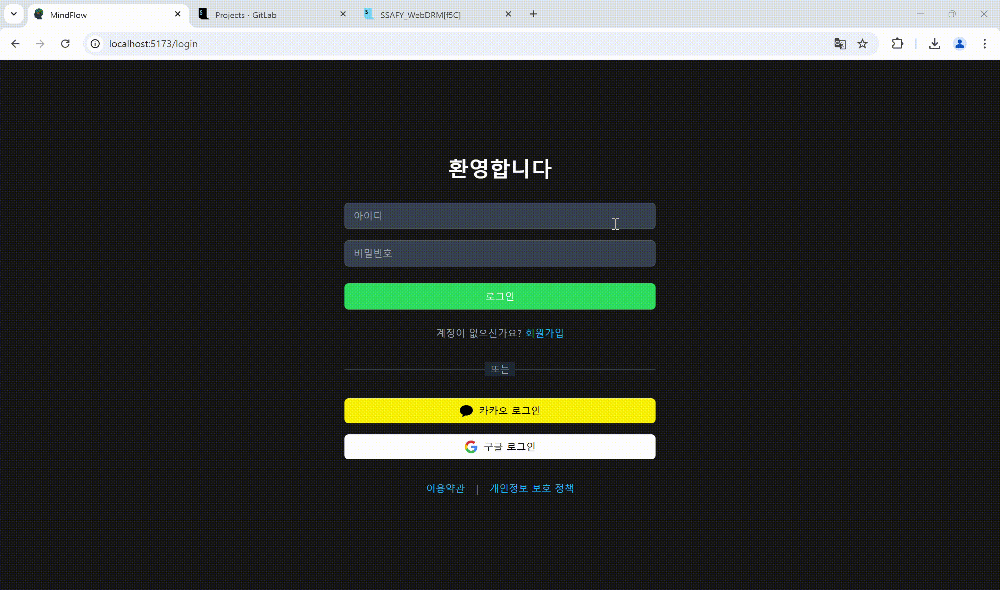
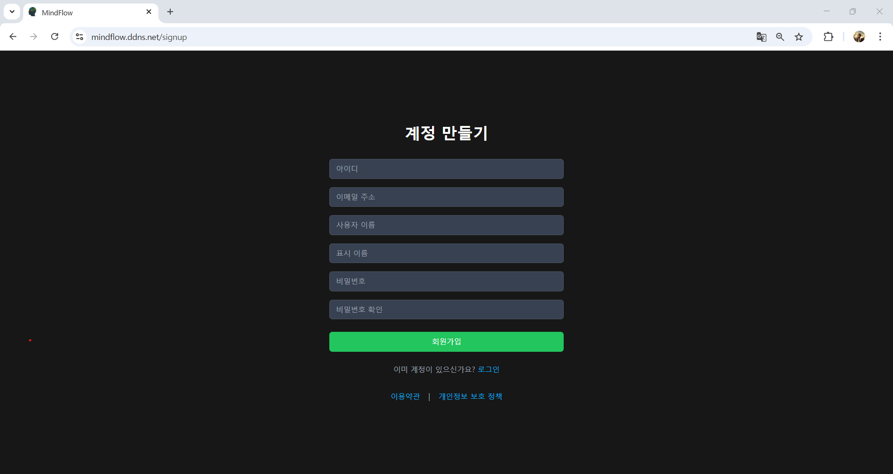
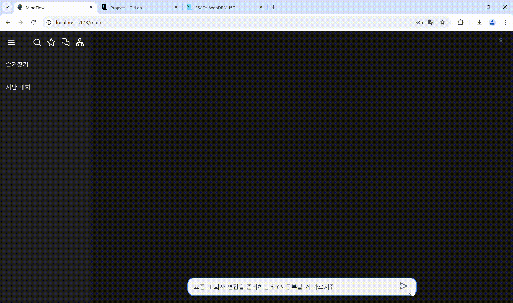
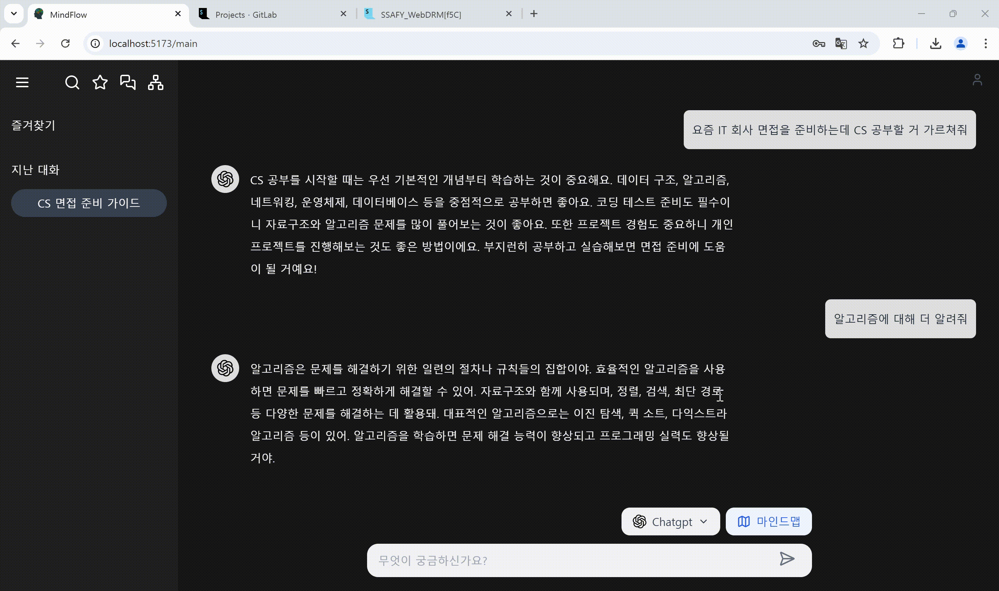

# 공통 프로젝트

## 프로젝트 소개

* 프로젝트명: 통합 생성형 AI와 마인드맵 프로젝트
* 프로젝트 목적: 시중의 여러 LLM 모델을 한 곳에서서 사용 / 관리할 수 있는 서비스
* 서비스 특징: 통합형 LLM 채팅 서비스와 대화 요약 마인드맵 생성 서비스
* 주요 기능
  - 채팅 중 LLM 모델 변경 (Google Gemini, CLOVA, ChatGPT, Claude 지원)
  - 채팅 내용 요약 및 마인드맵 자동 생성
  - 채팅방 즐겨찾기 및 검색 기능
  - 실시간 스트리밍 응답 제공 (WebSocket & LLM Streaming)
  - 마인드맵 그래프 생성 및 수정 기능 (Neo4j 기반)
* 주요 기술
  - LangChain
  - WebSocket
  - JWT Authentication
  - REST API
  - Redis
  - Docker
* 배포 환경
  - URL: // [마인드플로우](https://mindflow.ddns.net/)
  - 테스트 계정: love / love

## 팀 소개
* 우성윤: 팀장, LLM 채팅 기능 백엔드 담당
* 곽희섭: 부팀장, 인프라 담당
* 김세현: 채팅 및 메인 페이지 프론트엔드 담당
* 류현석: 미안드맵 기능 백엔드 담당
* 김동욱: 미안드맵 기능 프론트엔드 담당
* 이강민: 인가 시스템 백엔드 담당

## 프로젝트 상세 설명

#### 아키텍처

#### ERD

#### 랜딩페이지

#### 로그인

#### 회원가입

#### 새채팅

#### 모델 선택

#### 채팅 검색

#### 마인드맵 2D

#### 마인드맵 3D

